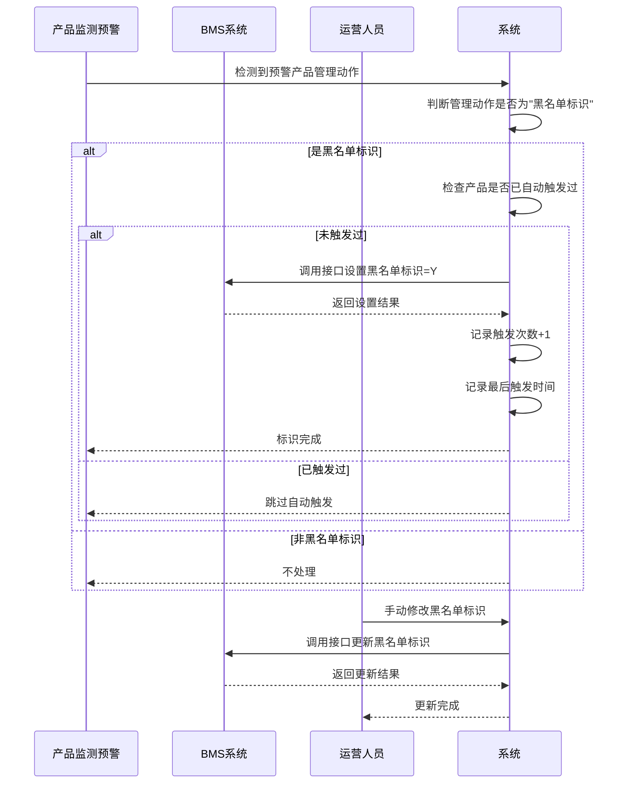

通用需求解析模板
1、禁止修改一级章节名称
2、功能标题下模板ID禁止移除
3、如需新增功能，请复制需求详情下2级章节及其内容
4、word的编号功能在导入时存在序号丢失等情况，建议手工编号
# 1.需求概述
## 1.1.背景和目标（必填）
| 需求概述	| [简明扼要地描述本需求的核心功能]| 
| --- | --- |
| 背景	| [简要描述功能的背景和创建原因] | 
| 目标	| [列出功能的主要目标和预期成果] | 


## 1.2.用户角色（选填）
| 用户/干系人类型	| 说明	| 优先级	| 关注点| 
| --- | --- | --- | --- |		
| - |  |  |  | 
| - |  |  |  | 


## 1.3.术语解释（选填）
| 术语名词	| 术语解释| 
| --- | --- |
| --- | --- |


## 1.4.价值指标（选填）

| 目标成效	| 价值指标	| 指标说明（计算规则）	| 目标值（选填）	| 基准值（选填）| 
|--- | --- | --- | --- | --- |	 				
|--- | --- | --- | --- | --- |

## 1.5.影响范围（选填）

| 名称（模块/流程/应用端）	| 是否受影响	| 备注| 
| --- | --- | --- |		
| --- | --- | --- |	

# 2.需求解析
## 2.1.现状业务流程/现状用户旅程/现状业务痛点（必填）

| 列1 | 列2 |
| --- | --- |
| 用户场景	| [描述此次需求针对的用户类型或干系人，及具体的业务场景]| 
| 痛点问题	| [描述在用户场景中，用户或干系人想要达成的目标，但面临的难点/痛点问题]| 
| 发生频度	| [描述这类问题的发生频度]| 
| 后果影响	| [描述这类问题的影响范围、每次发生对业务/用户的影响程度，尽量以量化的数据来表达，比如每次耗时XX小时]| 

[示例链接]

## 2.2.未来业务全景/未来业务流程/未来用户旅程（必填）

## 2.3.原型设计图（选填）

## 2.4.领域对象定义/ER图（选填）

## 2.5.功能清单（必填）
| 类型 | 关联产品* | 关联资产目录* | 功能名称* | 备注（送审隐藏） | 关联实施组* | 负责人* |
|  |  |  |  |  |  |  |
| 类型 | 关联产品* | 关联资产目录* | 功能名称* | 备注（送审隐藏） | 关联实施组* | 负责人* |


# 3.需求详情
## 3.1.业务性能需求描述


### 3.1.1.功能简述（必填）

### 3.1.2.功能入口

#### 3.1.2.1.入口路径（必填）

#### 3.1.2.2.入口规则（选填）

| 编号	| 名称	| 预置条件（GIVEN）	| 触发动作（WHEN）	| 预期结果（THEN）| 
| --- | --- | --- | --- | --- | 
| 1	| XX类型用户可以看到[收款明细待认领池]	| 当登录用户身份为[X类型用户]	| 在进入[收款认领]后	| 可以看到[收款明细待认领池]菜单| 


### 3.1.3.流程图（必填）
#### 3.1.3.1. 业务流程图
示例:


#### 3.1.3.2. 系统流程图
示例:
```mermaid
graph TD
    A[开始] --> B{接收到预警产品信息}
    B --> C{管理动作是否为"BMS-产品修改为黑名单标识，无法面客"?}
    C -->|是| D{该产品是否已自动触发过?}
    C -->|否| Z[结束]
    D -->|未触发| E[调用BMS接口设置黑名单标识=Y]
    D -->|已触发| Z
    E --> F[记录触发次数+1]
    F --> G[记录最后自动触发时间]
    G --> H[返回标识完成]
    H --> Z
    
    I[运营人员手动操作] --> J{操作类型}
    J -->|设置黑名单| K[调用BMS接口设置黑名单标识]
    J -->|取消黑名单| L[调用BMS接口取消黑名单标识]
    K --> M[返回操作结果]
    L --> M
```


### 3.1.4.交互原型设计

#### 3.1.4.1.原型图（必填）


#### 3.1.4.2.原型说明（选填）


#### 3.1.4.3.展示规则（选填）


| 编号	| 名称	| 预置条件（GIVEN）	| 触发动作（WHEN）	| 预期结果（THEN）| 
| --- | --- | --- | --- | --- | 
| 1	| X用户看到【收款明细待认领池】	| X用户业务范围内有X收款明细待认领	| 用户点击【收款明细待认领池】	| 1 看到【收款明细待认领】列表，且有X条记录
| 2	| X用户看到【收款明细待认领池】中每个待认领条目数据准确展示	| X用户业务范围内有3收款明细待认领	| 用户点击【收款明细待认领池】	| 1 字段X：展示值和格式为XX<br>2 字段X：展示值和格式为XX<br>3 字段X：展示值和格式为XX |
| 3	| 结果以正确顺序展示...| | | | 			


## 3.1.5.业务要素 （选填）

		
| 含义                | 数据来源与范围       | 展示/修改 | 是否必填 | 备注    |
|---------------------|----------------------|-----------|----------|------------------|
| 收款明细认领状态      | 未认领、部分认领、已认领、不用认领、认领中 | 仅展示    | n/a      | 值为"0-未认领、1-认领中、2-部分认领、3-已认领、4-不用认领"，默认为空查询全部 |
| 收款明细认领成功时间  | 格式：YYYY-MM-DD HH:MM:SS | 仅展示    |          | 该字段放在"认领状态"后面                                               |


## 3.1.6.业务操作规则（必填）

#### 3.1.6.1.如果选用用户故事范式：
[正常功能操作主路径]：正常操作主路径下，可能有多个具体的AC，比如单个认领、多个一起认领等
示例
场景1：X用户查看收款明细待认领项，并进行认领
| 编号	| 名称	| 预置条件（GIVEN）	| 触发动作（WHEN）	| 预期结果（THEN）| 
| --- | --- | --- | --- | --- | 				
| 1 |  |  |  |  | 
| 2 |  |  |  |  | 				


[正常功能操作分支路径]：正常操作分支路径也可能存在多个，每个分支路径可以有单独的AC
示例
场景2：X用户通过XX入口认领
| 编号	| 名称	| 预置条件（GIVEN）	| 触发动作（WHEN）	| 预期结果（THEN）| 
| --- | --- | --- | --- | --- | 			
| 1 |  |  |  |  | 
| 2 |  |  |  |  | 


[失败操作路径]：进行业务操作时，往往有相关的业务规则，当规则不满足时，就会操作失败。这里要列出所有用户会遇到的失败操作路径
示例：
场景3：X用户在XX情况下认领失败
| 编号	| 名称	| 预置条件（GIVEN）	| 触发动作（WHEN）	| 预期结果（THEN）| 
| --- | --- | --- | --- | --- | 			
| 1 |  |  |  |  | 
| 2 |  |  |  |  | 			


注意：进行业务操作时，往往有相关的业务规则，当规则不满足时，就会操作失败。这里要列出所有用户会遇到的失败操作路径

[异常处理]：注意：进行业务操作时，往往出现数据异常、后台异常等各种冲突情况，这里要说明当相关的异常情况出现时，所需要的处理逻辑及要求。每种情况都需要单独AC。
场景4：XX情况下，认领任务失败进行XX处理
| 编号	| 名称	| 预置条件（GIVEN）	| 触发动作（WHEN）	| 预期结果（THEN）| 
| --- | --- | --- | --- | --- | 			
| 1 |  |  |  |  | 
| 2 |  |  |  |  | 			
#### 3.1.6.2.如果选用传统PRD范式：
##### 3.1.6.2.1.用户操作及权限
示例：
| 菜单路径 | 用户交互操作 | 用户权限 | 数据权限 |
|----------|--------------|----------|----------|
| | 查看     | XX角色可以查看XX | XX机构的XX角色可以查看XX机构的数据 |
| | 新增     |              |          |          |
| | 修改     |              |          |          |
| | 删除     |              |          |          |
| | 导出     |              |          |          |
| | 批量操作 |              |          |          |
| | ...      |              |          |          |


##### 3.1.6.2.2.业务规则操作
| 操作 | 要素内容 | 详情 |
|------|----------|------|
| 查看 | 页面要素 | 1. 查看页面需展示的字段、字段顺序、字段取值等信息 |
| 新增 | 页面要素 | 1. 新增页面包含哪些字段要素<br>2. 针对每个新增要素字段说明：<br>1) 字段类型<br>2) 是否必填<br>3) 字段填写要求及限制，如长度、格式、可选项范围等<br>4) 字段间是否存在联动交互，具体如何交互 |
| | 新增业务规则 | 描述新增涉及的校验规则、逻辑；如必填控制、冲突控制等 |
| | 新增后的结果和影响 | 1. 新增后对用户、数据存储等的影响说明<br>2. 新增后对其他系统/用户的影响说明 |
| 修改 | 页面要素 | 1. 修改页面包含哪些字段要素<br>2. 针对每个修改要素字段说明：<br>1) 是否带出默认值，默认值是什么？<br>2) 是否支持修改，可修改范围是什么？ |
| | 修改业务规则 | 描述修改涉及的校验规则、逻辑，如必填控制、冲突控制等 |
| | 修改后的结果和影响 | 1. 修改后对用户、数据存储等的影响说明<br>2. 修改后对其他系统/用户的影响说明 |
| 删除 | 是否需要二次确认 | 1. 是/否，默认需要 |
| | 删除后的结果和影响 | 1. 删除后对用户、数据存储等的影响说明<br>2. 删除后对其他系统/用户的影响说明 |
| 导出 | 导出规则 | 1. 描述导出涉及的校验规则、逻辑，如限制导出xx条等 |
| | 导出后的结果和影响 | 1. 导出后对用户、数据存储等的影响说明<br>2. 导出后对其他系统/用户的影响说明 |
| 批量操作 | 批量操作规则 | 1. 描述批量操作包含哪些要素 |
| | 批量操作后的结果和影响 | 1. 批量操作后对用户、数据存储等的影响说明<br>2. 批量操作后对其他系统/用户的影响说明 |


### 3.1.7.埋点要求（选填）

### 3.1.8.其他非功能需求
### 3.1.8.1.其他补充需求（选填）


# 4.补充需求
## 4.1.业务性能需求描述（选填）
| 性能类型 | 性能需求描述
| --- | ---
| 业务处理性能 | 
| 业务容量 | 
| 业务响应时间 | 
| 日终批处理能力 | 

## 4.2.安全评估（选填）
1. 角色权限管理
- 用户角色权限管理

2. 用户登录认证
- 用户注册
- 用户登录  
- 密码认证  
- 短信验证码
- 人脸识别

3. 文件与数据输入输出
- 文件上传  
- 文件下载  
- 数据输入

4. 敏感数据处理（包含数据收集、传输、存储、使用）
- 处理敏感一级数据  
- 处理个人敏感数据    
- 处理单位敏感数据 
- 处理账户、交易、及合约数据
- 处理金融监管及报送数据 
- 处理综合管理数据
- 处理其他敏感数据   

5. 支付交易类场景
- 支付
- 抽奖
- 代金券使用  
- 支付交易类订单
- 以上均不涉及
## 4.3.其他必要补充说明（选填）
